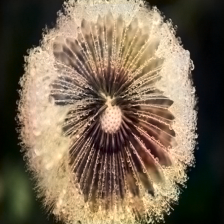
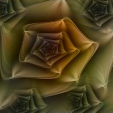
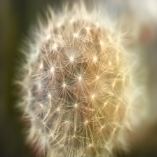

# Image Colorization using Convolutional Networks
This is a long overdue project I have been trying to get working ever since I read the article by Ryan Dahl on the topic. The idea of sematically understanding concepts in an image and color them with statistical prior knowledge gained from a training with a dataset.

The model was initially tested for architecture with the flowers dataset from tensorflow and later trained on the [LaMem dataset](http://memorability.csail.mit.edu) from MIT.

1. [Results](#results)
2. [Observations] (#observations)
3. [Useful Links] (#useful-links)
 
 
## Results 
The idea for the model architecture is very similar to that of "Residual Autoencoder" model by Ryan with modifications. The intiution is to have the imagenet model output layer from convolution (encoder) and then do transpose convolution and fuse with pool layers. Unlike ryan I tried to fuse only the higher pooling layers and didn't want the lower level layers for color prediction - the thought being higher level layers are compositional and capture concepts and the lower level layers are closely related to the modalities of the image. The below is crude representation of the architecture.

Architecture:

`**Image (Only L value)** -> 3x3 n64s1 -> ReLu -> VGG layer conv1_2 -> .. -> pool1 -> .. -> pool2 -> .. -> pool3 -> .. -> pool4 -> .. -> VGG relu5_4 -> conv_T 3x3 -> fuse with pool4 -> conv_T 3x3 -> fuse with pool3 -> conv_T 3x3 -> **a, b value prediction for Image**`

Note that there is no non-linearites added after the conv transpose operation. The loss was formulated as a simple MSE between the predicted a,b and the original a,b values for the image. Training was done for about 25 epochs with the learning rate halved every 3 epochs are so. Adam Optimizer was used and the initial learning rate was set to 1e-4. As seen below the training is very slow but produces reasonable results.

***Lab*** color space split for original colored image (top) and predicted colored image (bottom)

From the above plot we can infer that the network predicted color values comes from some conceptual understanding of the object. A few colorization results are as below. Notice how in the case of the child face the model predicts color for an image that has no color. 

**Left: Input - Middle: Predicted Color - Right: Original Color**

## Observations
- Creating a model from scratch and training was painfully slow. Tried the residual block architecture from Perceptual Losses for Real-Time Style Transfer by Johnson et. al which was incidentally used by folks from Twitter in their paper on Photo-Realistic Single Image Super-Resolution and Super-Resolution. 
  - The trained model from this architecture was able to produce green and blue colors at the right places after a few epochs but the training plateaued after that. 
- There were failures in the model based on VGG as can be seen from the image of truck and the toy although the colors were always consitent in the final model and didn't produce any patched color ouputs.
- Prominent colors such as those for skies, trees and white background were the first colors to be learnt. Also skin tone for humans was noticeably learnt with good predictions amongst other things. 

----
Some interesting outputs I got while working with flowers dataset. The outputs below are the results of applying the algorithm. The original colors for these flowers were nothing like the ones predicted :v:

   

## Useful Links
- Colorful Image Colorization, Richard Zang et. al. - [link](http://richzhang.github.io/colorization/)
- Ryan's blog post - [Automatic Colorization](http://tinyclouds.org/colorize/)
